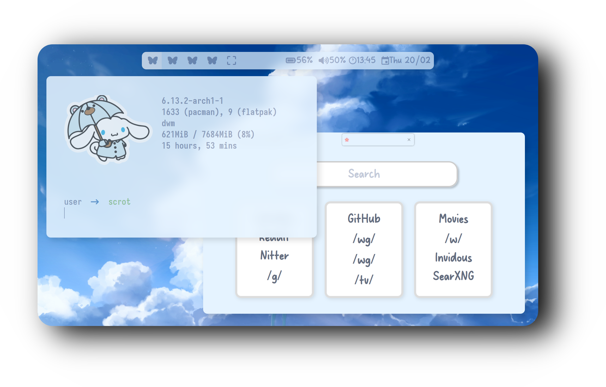

  <h2 style="font-size: 54px;">
    <strong>
      <a href="https://suckless.org/" style="text-decoration: none; color: inherit;">
        
        Dynamic Window Manager
      </a>
    </strong>
  </h2>

<h1>
      

 
  
## ⚙️ Features
- **Window Manager** :bento: [DWM](https://dwm.suckless.org/)
- **Application Launcher** :rocket: [Dmenu](https://tools.suckless.org/dmenu/)
- **Terminal Emulator** :leaves: [ST](https://st.suckless.org/)
- **Shell** :shell: [Fish](https://fishshell.com/)
- **Compositor** :shaved_ice: [Picom](https://github.com/yshui/picom)
- **Terminal with Graphics** :rocket: [ST](https://tools.suckless.org/st/)

### :octocat: †<samp>HI THERE! THANKS FOR DROPPING BY!</samp>

  

    
<strong>🚀 Resource Efficiency</strong>

    
Optimized for performance and minimal resource usage. On average, my setup consumes between <strong>250 MB and 400 MB of RAM</strong>, depending on the installed packages and background services. This lightweight configuration maximizes system resources for essential tasks and keeps everything running smoothly.

<h1>

## 🔑 Key Bindings

#### 📱 **Applications**

- **$mod+q** – KILL  
- **$mod+Return** – ST
- **$mod+f** – FIREFOX  
- **$mod+d** – DMENU  
- **$mod+e** – PCMANFM

